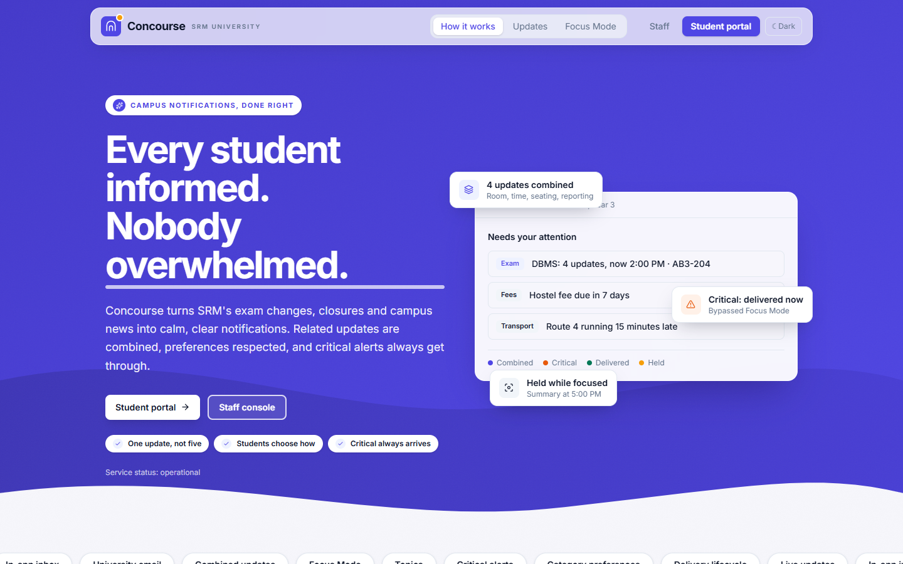
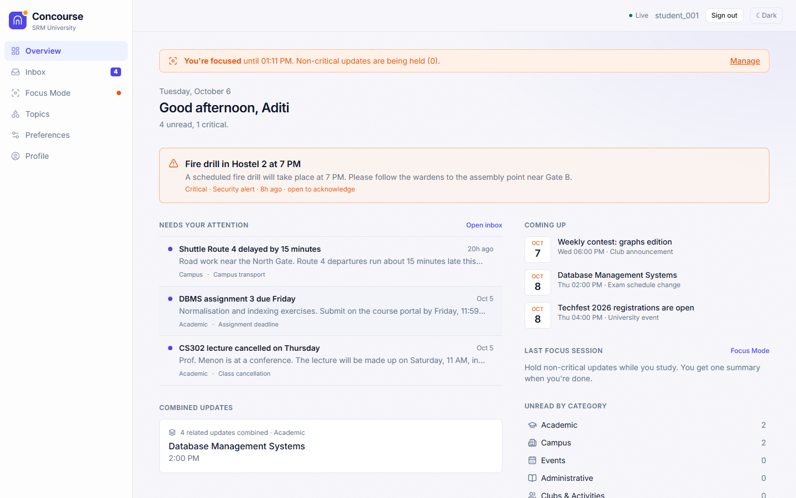
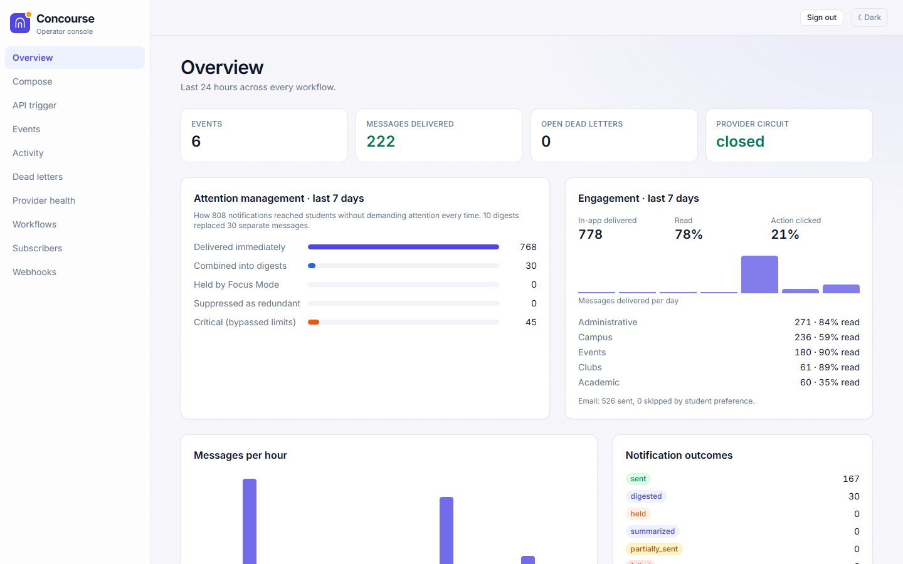
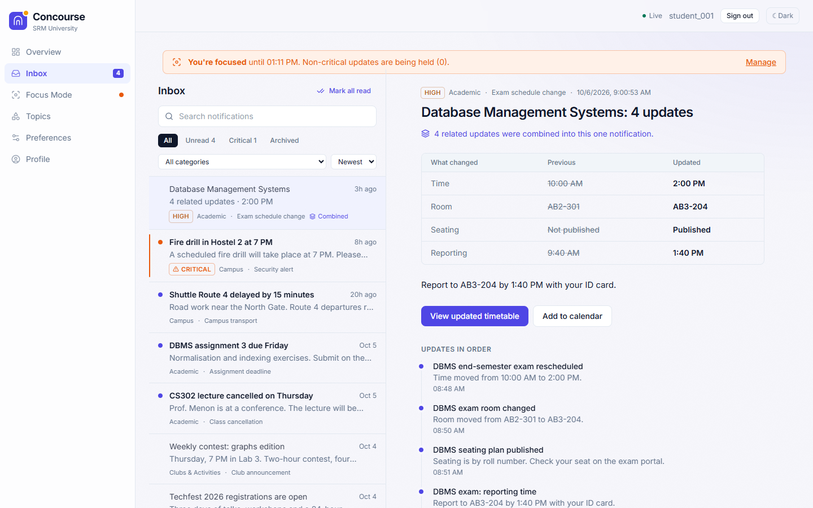
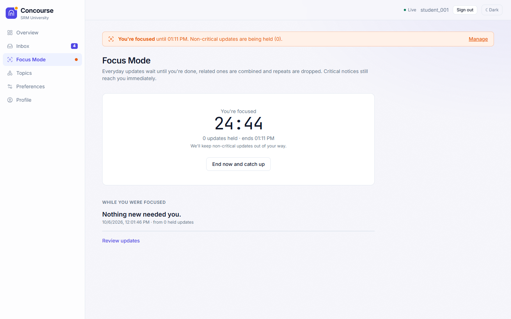
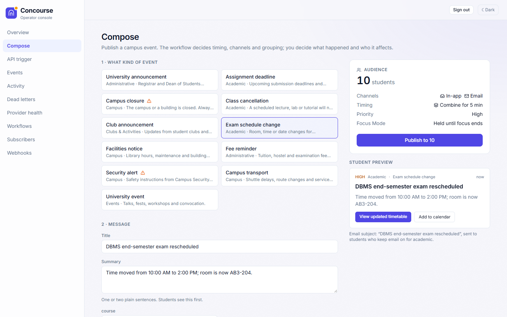
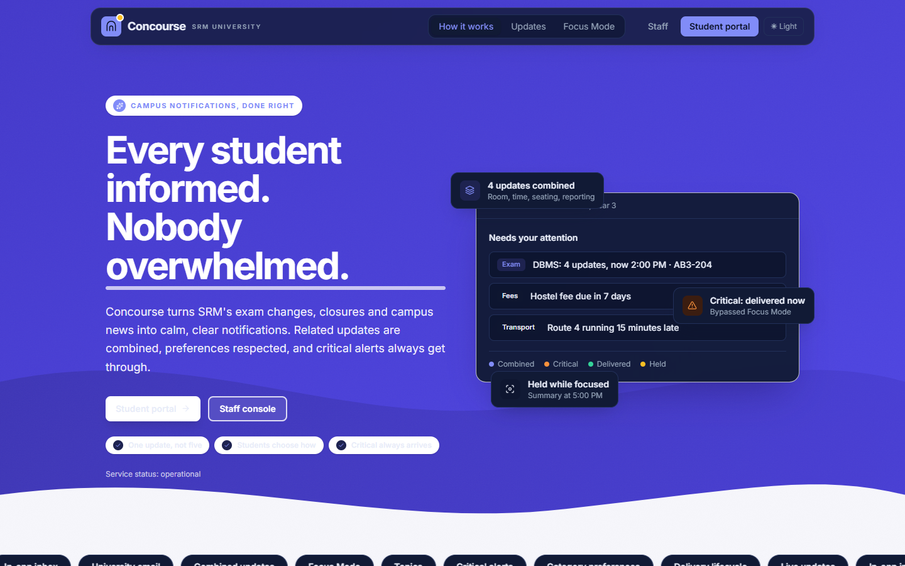
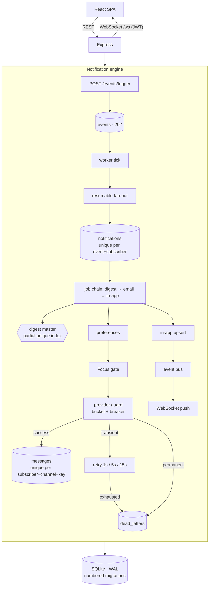

<div align="center">



# Concourse

### Campus notifications for SRM University

The exam moved. Every student knows — and nobody got ten emails about it.

<p>
  
  
  
  
  
</p>

<p>
  <a href="#quick-start"><b>Quick start</b></a> ·
  <a href="#product-tour"><b>Product tour</b></a> ·
  <a href="#architecture"><b>Architecture</b></a> ·
  <a href="#verification-dashboard"><b>Verification</b></a> ·
  <a href="#api-surface"><b>API</b></a> ·
  <a href="#scale--reliability-measured"><b>Scale</b></a>
</p>

</div>

<br>

## About

Concourse is a clean-room rebuild of a campus notification engine, built for **HACKBACK V2** from a frozen seven-document specification (`../docs/`). It turns campus events — an exam room change, a closure, a fee deadline — into notifications that reach the right students fast, through the channels they chose, combined when related, and never lost or duplicated when something goes wrong.

The spec documents were never edited. Where they were silent or contradicted each other, the decision made is recorded under [Implementation assumptions](#implementation-assumptions) rather than left implicit.

<br>

## Quick start

> Requires **Node.js 22.5+** (built-in `node:sqlite`; developed on Node 26). No Redis, MongoDB or Docker required.

```bash
cd campus-notification-engine
npm install
npm run demo
```

This seeds a believable SRM campus — **5** departments, **8** courses, **4** clubs, **4** residences, **180** students, **11** workflows — and replays three days of campus events **through the real engine** on a controlled clock, so every digest, read receipt and delivery state in the UI is genuine, not a fixture.

<table>
<tr><th align="left">Surface</th><th align="left">URL</th><th align="left">Sign in</th></tr>
<tr><td>Landing</td><td><code>http://localhost:3000/</code></td><td>—</td></tr>
<tr><td><b>Student portal</b></td><td><code>http://localhost:3000/app</code></td><td><code>student_001</code> (Aditi Rao, CSE, Year 3)</td></tr>
<tr><td><b>Staff console</b></td><td><code>http://localhost:3000/console</code></td><td>API key — local default <code>campus-admin-api-key-change-in-production</code></td></tr>
</table>

For a plain (non-demo) run: `npm run seed && npm start`. The production UI build is committed in `public/`; after editing `web/`, rebuild with `npm run build:web`.

<br>

## Product tour

<table>
<tr>
<td width="50%" valign="top">

**For students** — `/app`



- **Overview** — critical alerts pinned until opened, what needs attention, combined updates, upcoming dates, unread counts by category
- **Inbox** — All / Unread / Critical / Archived, category filter, search, sort, mark-all-read
- **Focus Mode** — hold everyday notifications for 30 min–4 h; critical alerts still arrive; one catch-up summary when the session ends
- **Topics** — follow or unfollow clubs and services
- **Preferences** — in-app and email, per category
- New notifications arrive **live over a WebSocket**

</td>
<td width="50%" valign="top">

**For staff** — `/console`



- **Compose** — pick the event, write what happened, target any audience, see a **live student-count estimate** and exact preview before publishing
- **Overview** — *attention management* and *engagement* dashboards
- **Events** — per-student **delivery lifecycle**: event → audience → workflow → timing → preference check → Focus Mode → delivery → read
- **Workflows**, Dead Letters, Provider Health, Subscribers, Webhooks

</td>
</tr>
</table>

<details>
<summary><b>More screenshots</b> — notification detail, Focus Mode, Compose, dark theme</summary>
<br>

| | |
|---|---|
|  <br> *Combined notifications show a clear Previous → Updated table* |  <br> *Focus Mode: hold the everyday, let critical through* |
|  <br> *Compose with live audience count and an exact student preview* |  <br> *Full dark theme support throughout* |

</details>

Critical notifications (closures, security alerts) are visually distinct, explain why they bypassed preferences and Focus Mode, and are enforced at the **engine level**, not just in the UI.

<br>

## What it does

<table>
<tr><th align="left" width="22%">Capability</th><th align="left">Detail</th></tr>
<tr><td><b>Ingest</b></td><td><code>202 Accepted</code>, de-duplicated by <code>transactionId</code> for 24 h via a unique index — concurrent duplicates collapse too</td></tr>
<tr><td><b>Fan-out</b></td><td>explicit lists, topics or broadcast, chunked by 100, with per-recipient progress — a failed fan-out resumes instead of dropping people</td></tr>
<tr><td><b>Digest</b></td><td>first event in a window becomes the master; later ones merge in; one message goes out when the window closes, guarded by a partial unique index. Can also merge <b>across workflows</b> via a shared <code>groupScope</code></td></tr>
<tr><td><b>Preferences</b></td><td>email / in-app, global, per category or per workflow, evaluated live on every send; critical workflows override mutes</td></tr>
<tr><td><b>Delivery</b></td><td>email via a provider adapter; in-app messages stored and <b>pushed live over WebSocket</b>, with polling as a fallback</td></tr>
<tr><td><b>Retry</b></td><td>1 s / 5 s / 15 s backoff, 3 attempts, same idempotency key — never a new notification or message</td></tr>
<tr><td><b>Provider protection</b></td><td>a 100/s token bucket and a circuit breaker (opens after 5 consecutive failures, probes after 30 s); a held send never spends an attempt</td></tr>
<tr><td><b>Dead-letter queue</b></td><td>permanent failures and exhausted retries are parked with a reason; staff can retry — same job, same key, never a duplicate — or dismiss</td></tr>
<tr><td><b>Observability</b></td><td>activity log, per-event delivery status, dashboards, provider health, webhook audit</td></tr>
</table>

Built with **React 19**, **TypeScript**, **Vite** and **Tailwind 4**, with self-hosted fonts (works offline). Light and dark themes, a responsive layout, keyboard focus states, `aria-live` announcements and a skip link. Credentials live only in `sessionStorage`; `localStorage` is used solely for the theme choice.

<br>

## Live verification

The three Killer Tests are automated (`npm run test:kt1`, `test:kt2`, `test:kt3`). For a live, clickable walkthrough, a **developer-only** page exists at `http://localhost:3000/internal/verify` — unlinked from the product and only served when `DEMO_MODE=true` (which `npm run demo` sets). Each card drives the real REST API and reads real database rows back to decide pass or fail.

<table>
<tr><th align="left">Card</th><th align="left">What happens</th></tr>
<tr><td>Killer Test 1</td><td>10 events, nothing delivered while the window is open → 1 email + 1 in-app containing all 10; <code>sent 1, digested 9</code></td></tr>
<tr><td>Killer Test 2</td><td>student mutes email → email step <code>skipped</code>, zero provider attempts; in-app still delivered</td></tr>
<tr><td>Killer Test 3</td><td>provider fails once → attempt 1 fails (500), attempt 2 succeeds, same idempotency key, exactly 1 email</td></tr>
<tr><td>Fix</td><td>4 webhook requests — forged (401), unsigned (401), unverifiable provider (400), valid (200) — only the valid one changes state</td></tr>
<tr><td>Differentiator</td><td>Focus on → 4 updates held → critical alert arrives anyway → session ends → one catch-up, redundant item suppressed</td></tr>
<tr><td>Gap&nbsp;G6</td><td>5 straight provider failures → circuit opens → held students keep their retry budget → after cooldown, all get exactly one email</td></tr>
<tr><td>Gap&nbsp;G7</td><td>permanent failure → dead-letter queue → staff retry → exactly 1 email, history preserved</td></tr>
<tr><td>Gap&nbsp;G8</td><td>three workflows sharing a digest group → 1 email naming all three</td></tr>
</table>

All eight pass in the headless browser suite (`npm run test:e2e`).

<br>

## Fix — fail-closed webhook signatures

`POST /webhooks/:provider` handles *inbound* provider delivery callbacks (not the producer API).

<table>
<tr><th align="left">Situation</th><th align="left">Response</th><th align="left">Applied?</th></tr>
<tr><td>Valid signature</td><td><code>200</code></td><td>✅</td></tr>
<tr><td>Invalid signature, or stale timestamp</td><td><code>401</code></td><td>❌</td></tr>
<tr><td>Missing signature</td><td><code>401</code></td><td>❌</td></tr>
<tr><td>No verifier for the provider</td><td><code>400</code></td><td>❌</td></tr>
<tr><td>Verifier exists, no secret configured</td><td><code>400</code></td><td>❌</td></tr>
<tr><td>Unsupported provider + explicit opt-in</td><td><code>202</code>, recorded <code>unverified</code></td><td>❌</td></tr>
</table>

Supported schemes: `generic` (HMAC-SHA256 over the raw body) and `mailgun` (HMAC-SHA256 of timestamp + token, with a tolerance window). Comparisons are constant-time; every request is audited without the signature or secret.

<br>

## Differentiator — Intelligent Focus Mode

While a session is active, non-critical deliveries are held. Critical ones arrive immediately — a `critical` workflow, `priority: "critical"`, or a rule like `minutesUntilExam < 30`. At session end, held events are grouped by the workflow's `correlationKey`; repeats are dropped, and facts already delivered by a critical alert (or read during the session) are suppressed. The student gets **one** catch-up notification through the normal pipeline, so mutes and retries still apply — it reports what changed (`room: A201 → H123`), not a replay of five messages.

<br>

## Architecture



<details>
<summary><b>Module map</b></summary>
<br>

<table>
<tr><th align="left">Path</th><th align="left">Responsibility</th></tr>
<tr><td><code>src/db.js</code></td><td>schema, numbered migrations, transactions, prepared-statement cache</td></tr>
<tr><td><code>src/engine/ingest.js</code></td><td>validation, idempotent accept, bulk/broadcast, resumable fan-out</td></tr>
<tr><td><code>src/engine/pipeline.js</code></td><td>job chain, digest merge, claim/execute, retry, provider guard, dead-letter writes</td></tr>
<tr><td><code>src/engine/deadletters.js</code></td><td>list, retry, bulk retry, dismiss</td></tr>
<tr><td><code>src/providers/guard.js</code></td><td>token bucket + circuit breaker</td></tr>
<tr><td><code>src/engine/focus.js</code> · <code>webhooks.js</code> · <code>subscribers.js</code> · <code>queries.js</code></td><td>Focus Mode, webhook verification, preferences, read models</td></tr>
<tr><td><code>src/http/</code></td><td>REST routes, console/demo routes, WebSocket gateway, auth</td></tr>
<tr><td><code>web/</code></td><td>UI source (React + TypeScript), builds into <code>public/</code></td></tr>
</table>

</details>

Four identities are kept distinct throughout: **event** (`transaction_id`), **notification** (unique per event + subscriber), **delivery attempt** (unique per job + attempt number), and **provider result** (`provider_message_id` / `provider_status`).

<br>

## Verification dashboard

<table>
<tr><th align="left">Command</th><th align="left">Proves</th><th align="left">Result</th></tr>
<tr><td><code>npm test</code></td><td>83 integration tests against a real engine, real SQLite, real HTTP and WebSocket</td><td>🟢 <b>83/83</b></td></tr>
<tr><td><code>npm run test:kt1</code> / <code>kt2</code> / <code>kt3</code></td><td>the three Killer Tests</td><td>🟢 pass</td></tr>
<tr><td><code>npm run test:gaps</code></td><td>one named test per gap (G1–G8), plus migrations</td><td>🟢 pass</td></tr>
<tr><td><code>npm run test:webhook</code> / <code>test:focus</code></td><td>the Fix and the Differentiator</td><td>🟢 pass</td></tr>
<tr><td><code>npm run test:e2e</code></td><td>full headless-browser walkthrough: staff compose → student receives live, digest detail, search, preferences, topics, Focus Mode, every console screen, all 8 verification cards, zero console errors</td><td>🟢 <b>35/35</b></td></tr>
<tr><td><code>npm run lint</code></td><td>eslint (server)</td><td>🟢 clean</td></tr>
<tr><td><code>npm run typecheck:web</code></td><td>TypeScript strict (UI)</td><td>🟢 clean</td></tr>
<tr><td><code>npm run bench -- 30000</code></td><td>30,000-student broadcast</td><td>see <a href="#scale--reliability-measured">below</a></td></tr>
<tr><td><code>npm run test:crash</code></td><td>process killed mid-delivery, restarted on the same database</td><td>🟢 pass, see below</td></tr>
</table>

`test:e2e` drives Edge or Chrome already on the machine via `playwright-core` — no browser download.

<br>

## Scale & reliability (measured)

`scripts/bench-broadcast.js` broadcasts one event (email + in-app) to N students on a real SQLite file, through the real worker loop, with an in-process stub provider so the measurement is of the engine rather than an SMTP server.

**Measured 2026-10-06**, one process, Node 26.4, Windows 11:

<table>
<tr><th align="left">Metric</th><th align="left">30,000 students</th><th align="left">Target</th></tr>
<tr><td>API accept (<code>202</code>)</td><td><b>2 ms</b></td><td>&lt; 500 ms ✅</td></tr>
<tr><td>All notifications + job chains created</td><td>2.7 s</td><td>—</td></tr>
<tr><td>First student notified</td><td>2.7 s after accept</td><td>—</td></tr>
<tr><td>All 30,000 emails + 30,000 in-app messages delivered</td><td><b>38.0 s</b></td><td>—</td></tr>
<tr><td>Cost per 100 students</td><td><b>127 ms</b></td><td>&lt; 1 s ✅</td></tr>
<tr><td>Duplicate emails</td><td><b>0</b></td><td>0 ✅</td></tr>
</table>

Delivery is depth-first — each student's in-app message follows their own email immediately rather than waiting behind every other student's. The benchmark surfaced and fixed a real O(n²) scan in job claiming (now three index-backed lookups), enabled `synchronous=NORMAL` under WAL, and cached prepared statements — together, roughly **5× faster**. At the default 100 emails/s provider limit, a 30,000-student broadcast takes about 5 minutes by design.

<details>
<summary><b>Crash recovery</b> — server hard-killed mid-delivery</summary>
<br>

`npm run test:crash`: 3,000-student broadcast, server hard-killed mid-delivery, restarted on the same database.

<table>
<tr><td>State at kill</td><td>902 emails + 902 in-app delivered, 1 job mid-send</td></tr>
<tr><td>Recovery</td><td>3.7 s (stale lock reclaimed)</td></tr>
<tr><td>Students with exactly one email / one in-app record</td><td><b>3,000 / 3,000</b></td></tr>
<tr><td>Duplicates, failed jobs, lost students</td><td><b>0 / 0 / 0</b></td></tr>
<tr><td>Provider calls</td><td>3,001 — one idempotency key sent twice</td></tr>
</table>

The one repeat is the single send in flight at the exact moment of the kill: accepted by the provider, but the result never committed before the process died. On restart it is re-sent with the **same idempotency key**; a provider that honours that key drops it, plain SMTP would not. This is the one duplicate the engine cannot prevent unilaterally — see [Known limitations](#known-limitations).

</details>

<br>

## API surface

Everything documented in `docs/API.md` is implemented; a repeated `transactionId` returns the cached `202` response with `"duplicate": true`. Additive routes (API-key protected unless noted):

<details open>
<summary><b>Full route table</b></summary>
<br>

<table>
<tr><th align="left">Route</th><th align="left">Purpose</th></tr>
<tr><td><code>PUT /admin/workflows/:id</code>, <code>GET /admin/workflows</code></td><td>define workflows: steps, digest window/scope, critical rules</td></tr>
<tr><td><code>PUT /admin/subscribers/:id</code>, <code>GET /admin/subscribers</code>, <code>PUT /admin/topics/:t/subscribers</code>, <code>GET /admin/topics</code></td><td>students and topics</td></tr>
<tr><td><code>GET /admin/stats</code>, <code>GET /admin/events</code></td><td>overview, event list</td></tr>
<tr><td><code>GET /admin/dead-letters</code>, <code>POST .../retry</code>, <code>POST .../dismiss</code></td><td>dead-letter queue</td></tr>
<tr><td><code>GET /admin/providers</code>, <code>POST /admin/providers/email/reset</code></td><td>provider health</td></tr>
<tr><td><code>GET /admin/webhooks</code></td><td>webhook audit and config (never secrets)</td></tr>
<tr><td><code>GET /inbox/feed</code>, <code>GET .../:id</code>, <code>POST .../read</code>, <code>.../click</code>, <code>POST /inbox/read-all</code> <i>(student JWT)</i></td><td>the product inbox — category, priority, actions, why-received, engagement</td></tr>
<tr><td><code>PATCH /inbox/preferences/categories/:category</code> <i>(student JWT)</i></td><td>category preferences</td></tr>
<tr><td><code>GET /inbox/topics</code>, <code>POST</code>/<code>DELETE .../follow</code>, <code>GET /inbox/profile</code> <i>(student JWT)</i></td><td>topics and profile</td></tr>
<tr><td><code>GET /admin/audiences</code>, <code>POST /admin/audiences/estimate</code>, <code>PUT /admin/audiences/:key</code></td><td>audience catalogue, live estimate, multi-group targeting</td></tr>
<tr><td><code>POST /inbox/focus-mode/start</code>/<code>end</code>, <code>GET .../status</code>/<code>summary</code> <i>(student JWT)</i></td><td>Focus Mode</td></tr>
<tr><td><code>POST /webhooks/:provider</code> <i>(signed, no key)</i></td><td>inbound webhook verification</td></tr>
<tr><td><code>GET /ws?token=&lt;student JWT&gt;</code></td><td>real-time in-app push</td></tr>
<tr><td><code>/admin/demo/*</code></td><td>only when <code>DEMO_MODE=true</code>; 404 otherwise, refused in production</td></tr>
</table>

</details>

<br>

## Implementation assumptions

<details>
<summary>Expand — 12 documented decisions where the spec was silent or ambiguous</summary>
<br>

1. **Storage** — SQLite (`node:sqlite`) with a DB-backed job table, in place of MongoDB + Redis/BullMQ. The spec allows "or similar" for the queue; this choice needs no infrastructure and is fully tested. The Mongo partial unique index maps directly to a SQLite partial unique index.
2. **Duplicate `transactionId`** — spec allows either 409 or a cached 202; this implementation returns the cached 202.
3. **`POST /inbox/session`** requires the API key by default, since the documented "public" behaviour would let anyone impersonate any student. `INBOX_SESSION_AUTH=public` restores it; `DEMO_MODE=true` defaults to it so the demo works end-to-end.
4. **In-app retry budget** matches email's (rather than 1), since the upsert makes retries harmless.
5. **A failed email still proceeds** to the next step, and is also parked in the dead-letter queue.
6. **Digest window** starts at the first event's submission; a digest step must be first in its workflow.
7. **Cancelling** an event removes only its own content from a shared digest master.
8. A **critical workflow** ignores mutes and Focus Mode; a **critical event** (priority or rule) bypasses Focus Mode only.
9. **Scope exceeded on purpose** — the spec lists a preferences UI, workflow designer and analytics as out of scope; this build includes a preferences screen and a JSON-based workflow editor (not a visual designer), and a polled dashboard (not streaming analytics).
10. **UI routes** are `/app` and `/console` (`/admin/*` is already the API namespace).
11. **Product metadata beyond the spec** — workflow category, priority, display name and actions; event priority levels `low`–`critical`; student department/year/programme; a topic catalogue.
12. **Brand** — "Concourse" and its visual identity are original; nothing is taken from the reference product.

</details>

<br>

## Known limitations

<details>
<summary>Expand</summary>
<br>

- Single process — claim logic is written to be multi-worker safe (conditional `UPDATE`, indexed claims) but untested with more than one.
- A crash between "provider accepted" and "result saved" re-sends the in-flight email with the same idempotency key (measured: 1 of 3,000). Only a provider honouring that key fully prevents the duplicate.
- The email provider is a console stub unless `SMTP_HOST` is set; the SMTP adapter has not been run against a real mail server.
- Circuit-breaker and rate-limiter state live in memory and reset on restart (safe default: starts closed).
- Webhook replay protection exists only for the timestamp-based scheme.
- `Dockerfile` is provided but not built in this environment.
- Not built: scheduled digests, preference history, multi-process tests, Mailpit email capture.

</details>

<br>

## Configuration

See `.env.example` (names only, no values). Notable settings: `DEMO_MODE`, `EMAIL_RATE_PER_SEC`, `EMAIL_BREAKER_THRESHOLD`, `EMAIL_BREAKER_COOLDOWN_MS`, `WEBHOOK_SECRET_<PROVIDER>`, `INBOX_SESSION_AUTH`. In production, the server refuses to start with placeholder secrets or `DEMO_MODE` enabled.

<br>

---

<div align="center">

Built for **SRM University** · HACKBACK V2

</div>
