# ARCHITECTURE.md — System Architecture


## 1. Architecture Overview

The Campus Notification Engine is an event-driven, asynchronous notification platform:

1. **Synchronous API layer** accepts events, validates them, and returns immediately.
2. **Persistent queue** (Redis + BullMQ or similar) ensures delivery reliability.
3. **Async worker processes** handle fan-out, preference evaluation, and delivery.
4. **MongoDB persistence** stores events, jobs, notifications, preferences, and activity logs.
5. **WebSocket gateway** pushes in-app notifications in real-time to subscribed students.
6. **Provider adapters** handle email and other external deliveries.

The system is designed for 30,000+ subscriber scale via asynchronous processing, with no blocking requests on the API layer.

## 2. Architecture Diagram

```mermaid
graph LR
    A[Event Producer API]
    API[API: POST /events/trigger]
    IDEMPOTENT["Idempotency Check<br/>(transactionId)"]
    QW["Trigger Queue<br/>(Redis/BullMQ)"]
    
    TW["Trigger Worker"]
    RESOLVE["Recipient Resolver<br/>(explicit / topic)"]
    FANOUT["Fan-Out to<br/>Process-Subscriber Queue<br/>(chunks of 100)"]
    
    PSQ["Process-Subscriber Queue"]
    PSW["Subscriber Worker"]
    CREATE["Create Notification<br/>+ Job Chain"]
    
    JOB[(MongoDB: Jobs,<br/>Notifications)]
    
    STD["Standard Queue<br/>(per-step jobs)"]
    RJ["Run Job Worker"]
    CLAIM["Atomic Claim<br/>(findOneAndUpdate)"]
    PREFS["Evaluate Preferences<br/>(per-channel)"]
    
    DISPATCH["Dispatch by Channel"]
    EMAIL["Email Provider<br/>(with Idempotency Key)"]
    INAPP["In-App: Create/Update<br/>Message (dedup)"]
    WSQ["WebSocket Queue"]
    WSG["WebSocket Gateway<br/>(emit to room)"]
    
    RETRY["Retry Handler<br/>(backoff + max attempts)"]
    STATUS["Activity Log<br/>(MongoDB)"]
    
    A -->|submit| API
    API --> IDEMPOTENT
    IDEMPOTENT -->|valid| QW
    QW --> TW
    TW --> RESOLVE
    RESOLVE --> FANOUT
    FANOUT -->|chunks| PSQ
    PSQ --> PSW
    PSW --> CREATE
    CREATE --> JOB
    
    JOB -->|first job in chain| STD
    STD --> RJ
    RJ --> CLAIM
    CLAIM -->|claimed| PREFS
    PREFS -->|if enabled| DISPATCH
    DISPATCH -->|email| EMAIL
    DISPATCH -->|in-app| INAPP
    
    EMAIL -->|success| STATUS
    EMAIL -->|failure| RETRY
    RETRY -->|retry| EMAIL
    RETRY -->|max exceeded| STATUS
    
    INAPP -->|create msg| JOB
    INAPP -->|emit ws| WSQ
    WSQ --> WSG
    WSG -->|push to client| STATUS
    
    RJ -->|advance chain| STD
```



## 3. Component Table

| Component | Responsibility | Why It Exists | Killer Tests |
|---|---|---|---|
| **API Layer** (POST /events/trigger) | Accept events, validate, check idempotency, enqueue | Async entry point; return immediately to caller | KT1, KT2, KT3 |
| **Idempotency Check** | transactionId uniqueness, 24h cache | Prevent duplicate event submission | KT1, KT3 |
| **Trigger Queue** | Persist event for reliable async start | Fault tolerance; decouple API from processing | All |
| **Trigger Worker** | Resolve workflow, lookup recipients, fan-out | Scalable recipient resolution | KT1, KT2 |
| **Fan-Out Logic** | Chunk subscribers (100 per chunk), enqueue process-subscriber | Avoid overloading single worker; enable parallel processing | All |
| **Process-Subscriber Worker** | Create Notification + Job chain per subscriber | Transactionalize per-subscriber state | KT2, KT3 |
| **Notification Record** | Persists event payload, channels, subscriber link | Single source of truth; payload dedup store | All |
| **Job Chain** | Ordered steps (Digest → Email → In-App) | Sequential workflow execution | All |
| **Standard Queue** | Per-step job queue (FIFO within worker) | Distribute delivery load; enable concurrency | All |
| **Run Job Worker** | Claim, execute, advance chain | Core delivery orchestrator | KT2, KT3 |
| **Atomic Claim** | findOneAndUpdate with status guard | Prevent concurrent duplicate execution | KT3 |
| **Preference Evaluator** | Check channel enabled at execution time | Skip steps per-channel mute | KT2 |
| **Digest Grouping** | Merge-or-create master for window | Aggregate related events | KT1 |
| **Email Provider Adapter** | Call SendGrid/Mailgun with idempotency key | External delivery; provider-level dedup | KT3 |
| **In-App Delivery** | Create/update Message, emit WebSocket | Dual delivery path; real-time user update | KT2 |
| **Retry Handler** | Exponential backoff, max attempts, idempotency key reuse | Transient failure recovery without duplicates | KT3 |
| **Activity Log** | Record every step, attempt, status | Observability; audit trail | All |
| **WebSocket Gateway** | Real-time emit to subscriber room | Instant notification to connected students | KT2 |

## 4. Event Lifecycle

```
1. TRIGGER (API) 
   - POST /events/trigger
   - Check idempotency (transactionId)
   - Validate payload
   - Enqueue to trigger-handler queue
   - Return 202 ACCEPTED

2. RESOLVE (Trigger Worker)
   - Lookup workflow by identifier
   - Resolve recipients (explicit list, topic expansion, broadcast)
   - Chunk into 100-subscriber batches
   - Enqueue to process-subscriber queue

3. CREATE (Subscriber Worker)
   - Create/update Subscriber record
   - Create Notification (one per subscriber)
   - Create Job chain (first job only enqueued; rest stored)
   - Upsert preference evaluation (critical flag, readOnly check)

4. GROUP (if Digest step)
   - Digest worker checks for existing DELAYED master
   - If none: mark this job DELAYED (master)
   - If exists: mark this job MERGED, add to master's event list
   - Prevent via unique index + retry on conflict

5. EXECUTE (Standard Queue Worker)
   - Claim job atomically (status: PENDING → RUNNING)
   - Evaluate filters and preferences
   - Skip step if channel muted or condition false
   - Dispatch to channel adapter (email, in-app)
   - Mark job status (SUCCESS or FAILED)
   - Advance to next job in chain (if exists)

6. DELIVER (Channel Adapter)
   - Email: call provider with idempotency key, retry on transient error
   - In-App: create/update message, emit WebSocket
   - Record status to activity log

7. RETRY (on failure)
   - Check if transient (network, timeout, rate limit)
   - Re-use idempotency key
   - Backoff: 1s, 5s, 15s (or configurable)
   - Max attempts: 3 (or configurable)

8. FINALIZE
   - Mark job COMPLETED or FAILED
   - Record attempt count and reason
   - Activity log entry
```

## 5. Preference Enforcement

Preferences are checked **at execution time** (when job runs), not at trigger time:

1. **Lookup phase** (when job claimed):
   - Fetch global preference (email on/off, in-app on/off).
   - Fetch workflow-level override (if exists).
   - Apply precedence: workflow override > global.
   - Check if workflow is critical (readOnly): if true, ignore preferences.

2. **Gate phase** (before dispatch):
   - For each channel step: is it enabled?
   - If disabled: mark step SKIPPED, advance to next.
   - If enabled: dispatch to channel adapter.

**Why execution time?**
- Allows preference changes between trigger and delivery (within seconds).
- No pre-computation required.
- Simpler for rebuilds.

**Killer Test KT2 requirement:** Email muted → email step SKIPPED → in-app step still executes.

## 6. Digest Architecture

### Digest Grouping Key

Events are grouped by:
- `subscriber_id`
- `workflow_id`
- `digest_value` (extracted from event payload or fixed)

Example: `subscriber_id=student_123 + workflow_id=exam_updates + digest_value=cs101`

### Digest Window

- **Time-based:** 5 minutes, 1 hour, 1 day (configurable per workflow).
- **Scheduled:** Fixed-time window (e.g., "daily at 9 AM").
- **Window starts:** From first event creation.
- **Window closes:** After elapsed time or explicit flush (e.g., end of day).

### Digest State Machine

```
Event 1 arrives
  → No master exists
  → Create job, mark DELAYED (master)
  → Schedule digest emit at T+window
  → Job enters queue

Event 2 arrives (within window)
  → Master exists
  → Create job, mark MERGED
  → Add to master's event list
  → Job blocked (not queued)

...Event N arrives (within window)
  → Repeat: mark MERGED, add to master list

Window closes (T+window)
  → Master job transitions DELAYED → QUEUED
  → Email/In-App steps execute once per aggregated digest
  → All merged jobs remain MERGED (not executed)

Result:
  → 1 Email sent (aggregated content)
  → 1 In-App message (aggregated content)
  → N-1 merged jobs never executed
```

### Duplicate Prevention

**Mechanism:** Unique partial index on MongoDB.

```
db.jobs.createIndex(
  {
    subscriberId: 1,
    templateId: 1,
    digestKey: 1,
    digestValue: 1,
    status: 1
  },
  {
    unique: true,
    partialFilterExpression: { status: "delayed" }
  }
)
```

**Outcome:** Only one DELAYED master can exist per (subscriber, workflow, digest value). Concurrent writers race; loser retries and finds master, marks MERGED.

**Killer Test KT1 requirement:** 10 events in 5 minutes → 1 master + 9 merged → 1 email/in-app.

## 7. Retry + Idempotency Architecture

### Problem KT3 Addresses

Original Novu:
- Email failures NOT retried.
- Email re-execution creates duplicate Message.
- No idempotency key sent to provider.

Rebuild solution: Exactly-once effect via three mechanisms.

### Mechanism 1: Idempotency Key per Delivery

Each logical delivery has an immutable idempotency key:

```
idempotency_key = hash(notification_id + step_id + channel_type)
  = hash("notif_xyz + step_email + email")
  = "idem_abc123def456"
```

Key is created once and never changes, even on retry.

### Mechanism 2: Provider-Level Dedup

Email provider (SendGrid, Mailgun) is called with idempotency key:

```
POST /mail/send HTTP/1.1
X-Idempotency-Key: idem_abc123def456
{
  "to": "student@university.edu",
  "subject": "Exam Update",
  "body": "..."
}
```

Provider caches response for 24h:
- **First call (fails):** Provider logs attempt, returns error.
- **Retry (same key):** Provider recognizes key, returns cached response (success), no duplicate send.

### Mechanism 3: Application-Level Dedup

For in-app delivery, duplicate detection via lookup:

```
SELECT * FROM messages
WHERE notification_id = X
  AND step_id = Y
  AND channel = 'in-app'
LIMIT 1
```

If exists: update (e.g., mark unseen, refresh timestamp).
If not: create new.

### Retry Strategy

```
Attempt 1 (immediate)
  → Send email with idempotency_key
  → Fail: network timeout, 500 error, rate limit
  → Mark job RETRYING, schedule retry

Backoff: 1 second

Attempt 2
  → Send email with SAME idempotency_key
  → Provider recognizes key:
      - If previously succeeded: return cached response (success)
      - If previously failed: retry send (may succeed now)
  → Succeed: mark job SUCCESS
  → Fail: mark RETRYING, schedule next retry

Backoff: 5 seconds

Attempt 3
  → Similar
  → Max attempts = 3 exceeded
  → Mark job FAILED (permanent)
```

**Killer Test KT3 requirement:** Failed send retried without duplicates → idempotency key prevents provider from resending → exactly-once effect.

### Retry Configuration (per channel)

```
Email:
  - max_attempts: 3
  - backoff: [1s, 5s, 15s]
  - transient_errors: [500, 502, 503, 429, timeout]

In-App:
  - max_attempts: 1 (no retry; fire-and-forget)
  - transient_errors: none (best-effort)
```

## 8. Scale Considerations

### Async Fan-Out

- API returns 202 before any worker processing.
- Subscriber processing happens in background.
- No blocking database writes on critical path.

### Chunking

- Recipients chunked into 100-subscriber batches.
- Each chunk enqueued to process-subscriber queue.
- 30,000 students → 300 queue jobs (parallelizable).

### Concurrent Workers

- Trigger worker: 1-N instances (I/O bound, low CPU).
- Process-subscriber worker: 10-20 instances (light CPU, DB writes).
- Standard (delivery) worker: 50-200 instances (provider I/O bound).
- WebSocket worker: 10-50 instances (emit broadcasts).

### Queue Design

- Trigger queue: ~O(30,000 events per day) = low traffic.
- Process-subscriber queue: ~O(300 batches per large event).
- Standard queue: ~O(300 batches * workflow_steps) = ~1000s jobs per event.
- All jobs persist in MongoDB until executed.

### Lock Duration

- Job claim lock: 90 seconds (configurable).
- If worker crashes, job reclaimed after 90s.
- Heartbeat during execution (every 20-30s) to prove liveness.

### Persistence Strategy

- **Payload dedup:** Notification stores payload once; Job references via notification_id.
- **Step dedup:** Job stores step ID + template ID only; worker rehydrates from live workflow.
- Result: ~50% reduction in queue message size.

## 9. Failure Scenarios

| Scenario | Trigger | Subscriber | Delivery | Recovery |
|---|---|---|---|---|
| **Invalid event** | Reject 400 | N/A | N/A | Caller retries with valid payload |
| **Unknown subscriber** | Skip | Log warning, continue | N/A | Activity log shows skipped |
| **Muted channel** | OK | OK | SKIPPED (no send) | Expected; proceed to next step |
| **Email provider 500** | OK | OK | FAILED (first time) | Retry with backoff; idempotency key prevents duplicate |
| **Email provider offline (extended)** | OK | OK | FAILED (all 3 attempts) | Mark permanently failed; activity log shows failed |
| **In-app send fails** | OK | OK | FAILED (best-effort, no retry) | Log error; proceed to next step |
| **Worker crash mid-execution** | OK | OK | RUNNING → reclaimed after 90s | Heartbeat missing → reclaimed by healthy worker; retry |
| **Duplicate event (same transactionId)** | Deduplicated (cached response) | N/A | N/A | Caller receives same 202 response |
| **Digest window expires, no events** | OK | N/A | SKIPPED (no master created) | No job, no emit; normal |
| **Burst of 100 concurrent events** | OK | Queued/parallelized | OK (queue scales) | Concurrent workers handle; no duplicates via atomic claim |

## 10. Key Design Decisions

### Decision 1: Asynchronous Processing
**Why:** 30,000 subscribers cannot be processed synchronously. API must return immediately.
**Trade-off:** Eventual consistency (delays of seconds to minutes). Accept for campus notifications.

### Decision 2: Digest as Workflow Step (not automatic)
**Why:** Simplicity. Workflow explicitly decides when to digest.
**Trade-off:** Requires admin to configure digest step. More predictable than implicit deduplication.

### Decision 3: Preference Evaluation at Execution Time
**Why:** Allows preference changes between trigger and delivery. Simpler than pre-computing.
**Trade-off:** Requires preference lookup per job (cacheable).

### Decision 4: Idempotency Key to Provider (not just at API)
**Why:** Provider-level dedup is strongest guarantee; not all providers support it, but major ones (SendGrid, AWS SES) do.
**Trade-off:** Requires provider support. Fallback: application-level dedup (double-send detection in activity log).

### Decision 5: Job Chain (not DAG)
**Why:** Linear workflow is simpler than arbitrary branching. Campus notifications typically sequential (digest → email → in-app).
**Trade-off:** Cannot support complex branching (if/else, parallel steps). Acceptable for MVP.

### Decision 6: Fire-and-Forget WebSocket Emit
**Why:** In-app notifications are best-effort. No delivery guarantee needed (student opens app to check).
**Trade-off:** Messages may not reach if student is offline. Accept for campus use case.

### Decision 7: Atomic Job Claim (no distributed lock)
**Why:** MongoDB findOneAndUpdate is atomic, no need for external lock service (Redis, Zookeeper).
**Trade-off:** Slightly higher DB load. Acceptable for campus scale.

---

**Killer Test Mappings:**
- **KT1:** Digest grouping + unique master index + time window.
- **KT2:** Preference evaluation at execution time + per-channel skip logic.
- **KT3:** Idempotency key to provider + retry with backoff + dedup.

All three are supported end-to-end by this architecture.
