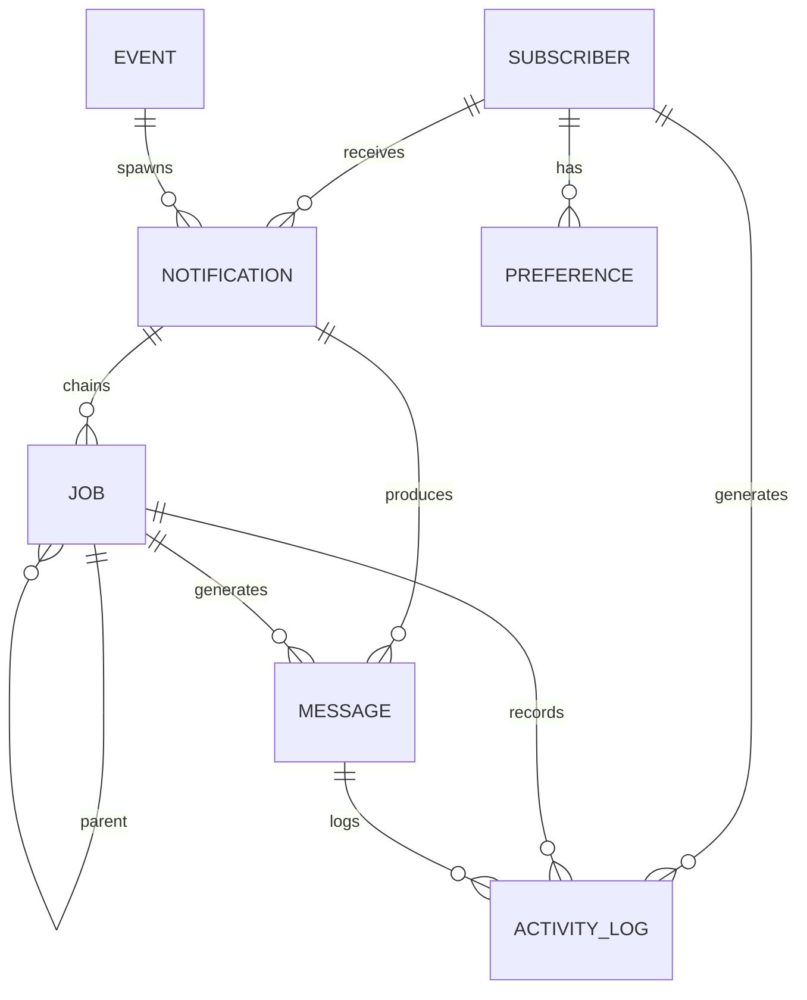

# DATA_MODEL.md — Database Schema


## 1. Entity Overview

| Entity | Purpose | Killer Tests |
|---|---|---|
| **Event** | Immutable trigger submission | KT1, KT3 (idempotency) |
| **Notification** | Per-subscriber notification instance | All |
| **Job** | Workflow step execution unit | KT1 (digest grouping), KT2 (preference), KT3 (retry) |
| **Message** | Delivered message (email, in-app) | KT2 (in-app), KT3 (dedup) |
| **Preference** | User notification preferences | KT2 (email muted) |
| **Subscriber** | University student record | All |
| **ActivityLog** | Audit trail of all actions | All (observability) |

## 2. Entity Definitions

### Event
Immutable record of trigger submission (for idempotency cache).

```
{
  _id: ObjectId,
  transactionId: String (unique, 24h TTL),
  organizationId: String,
  environmentId: String,
  workflowId: String,
  payload: Object,
  recipientType: Enum ("explicit" | "topic" | "broadcast"),
  recipients: [String],  // subscriber IDs or topic name
  status: Enum ("processed" | "failed"),
  createdAt: Date,
  expiresAt: Date (24h from creation for TTL)
}
```

**Indexes:**
- Unique on (transactionId, organizationId, environmentId)
- TTL on expiresAt (24h auto-delete)

**Why:** Prevent duplicate event submission. Caller can safely retry POST /events/trigger with same transactionId; API returns cached result.

---

### Notification
Per-subscriber notification record. Links event to subscriber.

```
{
  _id: ObjectId,
  organizationId: String,
  environmentId: String,
  transactionId: String,
  workflowId: String,
  _subscriberId: ObjectId (FK to Subscriber),
  payload: Object,
  channels: [String] (e.g., ["email", "in-app"]),
  critical: Boolean (readOnly workflow),
  status: Enum ("pending" | "processing" | "sent" | "failed" | "partially_sent"),
  deliveryState: {
    email: Enum ("pending" | "sent" | "failed" | "skipped"),
    inApp: Enum ("pending" | "sent" | "failed" | "skipped")
  },
  createdAt: Date,
  updatedAt: Date
}
```

**Indexes:**
- Compound on (transactionId, _subscriberId) for dedup checks
- On (workflowId, _subscriberId, createdAt) for activity queries
- On (status) for filtering pending notifications

**Why:** Single source of truth per subscriber. Payload stored once (not duplicated per job/step). Delivery state rollup for observability.

---

### Job
Workflow step execution unit. Forms a chain (parent-child link).

```
{
  _id: ObjectId,
  organizationId: String,
  environmentId: String,
  transactionId: String,
  _notificationId: ObjectId (FK to Notification),
  _parentJobId: ObjectId (FK to self, nullable for first step),
  workflowId: String,
  _subscriberId: ObjectId,
  stepId: String (unique within workflow),
  stepType: Enum ("trigger" | "digest" | "email" | "in-app" | "delay"),
  status: Enum ("pending" | "queued" | "running" | "completed" | "failed" | "skipped" | "merged" | "delayed"),
  
  // For Digest steps only
  digest: {
    digestKey: String (e.g., "exam_id"),
    digestValue: String (e.g., "CS101"),
    type: Enum ("regular" | "scheduled"),
    windowMs: Int (5 * 60 * 1000 for 5 minutes),
    masterJobId: ObjectId (if this is merged, points to master),
    events: [Object] (aggregated events for email/in-app)
  },
  
  // Retry state
  attempts: Int (current attempt, 0-3),
  maxAttempts: Int (configurable, default 3),
  nextRetryAt: Date (null if no retry pending),
  lastError: String (reason for last failure),
  idempotencyKey: String (immutable, e.g., hash(notif_id + step_id)),
  
  // Execution
  startedAt: Date (nullable),
  completedAt: Date (nullable),
  duration: Int (milliseconds),
  
  createdAt: Date,
  updatedAt: Date
}
```

**Indexes:**
- Primary key _id
- Compound unique on (workflowId, _subscriberId, digestKey, digestValue, status) where status="delayed"
  - **Why KT1:** Prevents two DELAYED masters for same (subscriber, workflow, digest value)
- On (_notificationId, stepType) for job lookup by notification
- On (_parentJobId) for chain traversal
- On (status="queued") for worker polling
- On (transactionId) for cancel operations
- On (nextRetryAt) for retry scheduling

**Why:** Forms ordered chain (Digest → Email → In-App). Digest step manages grouping. Retry state tracks attempts and backoff.

---

### Message
Delivered message record (email or in-app).

```
{
  _id: ObjectId,
  organizationId: String,
  environmentId: String,
  _notificationId: ObjectId (FK to Notification),
  _jobId: ObjectId (FK to Job),
  _subscriberId: ObjectId (FK to Subscriber),
  channel: Enum ("email" | "in-app"),
  content: String,
  subject: String (email only),
  providerMessageId: String (e.g., SendGrid message ID),
  idempotencyKey: String (e.g., idem_abc123, matches Job.idempotencyKey),
  
  // In-App specific
  seen: Boolean (false by default),
  archived: Boolean (false by default),
  
  // Email specific
  recipientEmail: String,
  
  status: Enum ("sent" | "failed" | "delivery_failed"),
  failureReason: String (nullable),
  
  createdAt: Date,
  updatedAt: Date
}
```

**Indexes:**
- Unique on (transactionId, workflowId, _subscriberId, channel, idempotencyKey)
  - **Why KT3:** Dedup for same logical delivery. If Message exists for idempotency key, update; else create.
- Compound on (_jobId, channel) for lookup by job
- On (_subscriberId, channel, createdAt) for in-app feed queries
- On (status="failed") for retry dashboard

**Why:** Persistence of sent messages. Dedup key prevents re-sending. In-app can be updated (unseen flag). Email can be tracked (providerMessageId).

---

### Preference
Per-subscriber notification preferences.

```
{
  _id: ObjectId,
  organizationId: String,
  environmentId: String,
  _subscriberId: ObjectId (FK to Subscriber, unique per subscriber),
  scope: Enum ("global" | "workflow"),
  workflowId: String (nullable, only if scope="workflow"),
  
  channels: {
    email: Boolean (default true),
    inApp: Boolean (default true),
    sms: Boolean (default false, not MVP),
    push: Boolean (default false, not MVP)
  },
  
  readOnly: Boolean (false, set by admin for critical workflows),
  
  createdAt: Date,
  updatedAt: Date
}
```

**Indexes:**
- Unique on (organizationId, environmentId, _subscriberId, scope, workflowId)
- On (_subscriberId, scope) for preference lookup

**Why KT2:** Mutable per-channel preferences. Evaluated at execution time. readOnly flag allows critical workflows to ignore mutes.

---

### Subscriber
University student record.

```
{
  _id: ObjectId,
  organizationId: String,
  environmentId: String,
  subscriberId: String (external ID, e.g., "student_12345", unique per environment),
  email: String,
  firstName: String (optional),
  lastName: String (optional),
  timezone: String (optional, e.g., "America/New_York"),
  channels: {
    email: String (e.g., "student_12345@university.edu"),
    phone: String (optional, not MVP)
  },
  metadata: Object (custom fields),
  
  createdAt: Date,
  updatedAt: Date
}
```

**Indexes:**
- Unique on (organizationId, environmentId, subscriberId)
- On (email) for lookups

**Why:** Immutable student identity. External systems reference by subscriberId. Email resolved here.

---

### ActivityLog
Audit trail for every step and attempt.

```
{
  _id: ObjectId,
  organizationId: String,
  environmentId: String,
  transactionId: String,
  _notificationId: ObjectId,
  _jobId: ObjectId,
  _subscriberId: ObjectId,
  workflowId: String,
  stepId: String,
  stepType: String,
  
  event: Enum ("job_created" | "job_queued" | "job_started" | "step_skipped" | "email_sent" | "email_failed" | "inapp_created" | "retry_scheduled" | "delivery_success" | "delivery_failed"),
  status: Enum ("success" | "failure" | "skipped"),
  message: String (human-readable, e.g., "Email sent to student@university.edu"),
  attempt: Int (1, 2, 3),
  error: String (nullable),
  
  createdAt: Date
}
```

**Indexes:**
- On (_subscriberId, createdAt) for per-student activity feed
- On (transactionId) for event drill-down
- On (workflowId, createdAt) for per-workflow analytics
- On (event) for filtering by event type

**Why:** Full visibility. Answer: "Did this student get this email?" Search by subscriber, transaction, workflow, or event type.

---

## 3. Relationships

```
Event
  ├─ 1:N → Notification (one event, many subscribers)
  │
Notification
  ├─ 1:N → Job (one notification, many steps)
  ├─ 1:N → Message (one notification, multiple delivery attempts)
  └─ N:1 ← Subscriber
  
Job
  ├─ N:1 ← Notification
  ├─ 1:1 ↔ (self._parentJobId) Parent Job (chain)
  └─ 1:N → Message (job produces messages)
  
Message
  ├─ N:1 ← Job
  ├─ N:1 ← Notification
  └─ N:1 ← Subscriber
  
Preference
  ├─ N:1 ← Subscriber
  └─ N:1 ← Workflow (optional)
  
Subscriber
  ├─ 1:N ← Preference (global + per-workflow)
  ├─ 1:N ← Notification
  └─ 1:N ← ActivityLog
  
ActivityLog
  ├─ N:1 ← Notification
  ├─ N:1 ← Job
  └─ N:1 ← Subscriber
```

## 4. Constraints

### Uniqueness Constraints

| Constraint | Purpose | Killer Test |
|---|---|---|
| Event(transactionId, orgId, envId) unique, 24h TTL | Idempotency | KT1, KT3 |
| Job(workflowId, subscriberId, digestKey, digestValue, status='delayed') unique | Prevent dual digest masters | KT1 |
| Message(transactionId, workflowId, subscriberId, channel, idempotencyKey) unique | Prevent duplicate delivery | KT3 |
| Preference(orgId, envId, subscriberId, scope, workflowId) unique | Single preference per scope | KT2 |
| Subscriber(orgId, envId, subscriberId) unique | External ID mapping | All |

### Foreign Key Constraints

- Job._notificationId → Notification._id (cascade delete on notification cleanup)
- Job._parentJobId → Job._id (self-referential, nullable for first step)
- Message._notificationId → Notification._id
- Message._jobId → Job._id
- Message._subscriberId → Subscriber._id
- Preference._subscriberId → Subscriber._id
- ActivityLog._notificationId → Notification._id
- ActivityLog._jobId → Job._id
- ActivityLog._subscriberId → Subscriber._id

### Status Constraints

**Job Status Machine:**
```
PENDING → QUEUED → RUNNING → {COMPLETED | FAILED | SKIPPED}
         ↓                        ↓
       DELAYED (for digest)    RETRYING ← [retry backoff] ← FAILED
         ↓
      (after window)
         ↓
       QUEUED
       
MERGED jobs never transition to QUEUED (buried under master job).
```

**Notification Status Rollup:**
```
pending: all jobs PENDING
processing: any job RUNNING
sent: all jobs COMPLETED or SKIPPED
failed: any job FAILED (after max retries)
partially_sent: some jobs SUCCESS, some SKIPPED
```

## 5. Delivery State (Per-Channel)

**Notification.deliveryState** tracks per-channel outcome:

```
{
  email: "pending" | "sent" | "failed" | "skipped",
  inApp: "pending" | "sent" | "failed" | "skipped"
}
```

- **pending:** Job not yet started.
- **sent:** Message created and sent (or queued for send).
- **failed:** Job failed after max retries.
- **skipped:** Step skipped due to preference or condition.

Rollup logic: if all channels "sent", Notification.status = "sent". If any "failed", = "failed". If any "pending", = "processing".

## 6. Preferences

### Global Preference (per subscriber)
```
{
  _subscriberId: ObjectId,
  scope: "global",
  channels: { email: true, inApp: true },
  readOnly: false
}
```

### Workflow-Level Preference (per subscriber, per workflow)
```
{
  _subscriberId: ObjectId,
  scope: "workflow",
  workflowId: "exam-updates",
  channels: { email: false, inApp: true },  // overrides global email
  readOnly: false (can be true for critical workflows)
}
```

**Precedence (at execution time):**
1. Lookup workflow preference (if exists).
2. If not, use global preference.
3. If readOnly = true (critical workflow), ignore mutes (force all channels enabled).
4. Default: all channels enabled if no preference found.

## 7. Digest State

**Job.digest (only for digest steps):**

```
{
  digestKey: "exam_id",
  digestValue: "CS101",
  type: "regular",
  windowMs: 300000,  // 5 minutes
  masterJobId: ObjectId (if this is MERGED job),
  events: [
    { timestamp, payload, attempt },
    { timestamp, payload, attempt },
    ...
  ]
}
```

**State machine:**

1. **Event 1 arrives:**
   - Create Job with status="delayed", digest={digestKey, digestValue, ...}
   - No matching DELAYED master exists → Job becomes master
   - Schedule digest emit at T + windowMs

2. **Event 2 arrives (within window):**
   - Query: find DELAYED master with (subscriberId, workflowId, digestValue)
   - Master exists → create Job with status="merged", digest.masterJobId pointing to master
   - Master updates digest.events array (append new event)

3. **Window closes:**
   - Master job status "delayed" → "queued"
   - Enqueue to standard queue (now it will execute)
   - Email/In-App steps execute once, using digest.events as aggregated content
   - Merged jobs remain "merged" (never queued; silent skip)

## 8. Idempotency

### Transactional (API Level)
**Event.transactionId:**
- Unique within 24h.
- Caller supplies or API generates.
- API returns 202 ACCEPTED + cached Event record on duplicate.
- Cache expires after 24h (idempotency window).

### Delivery (Step Level)
**Job.idempotencyKey:**
- Hash of (notification_id, step_id, channel_type).
- Immutable; created once at job creation.
- Example: SHA256("notif_abc123_step_email_email") = "idem_abc123def456"

**Message.idempotencyKey:**
- Same as Job.idempotencyKey for traceability.
- Used to query existing Message before creating new.
- Passed to email provider for provider-level dedup.

**Example Retry Scenario (KT3):**
```
Attempt 1:
  - Job._id = "job_123"
  - Job.idempotencyKey = "idem_abc123"
  - Send to provider with header: X-Idempotency-Key: idem_abc123
  - Provider: cache miss, sends email, caches response (success)
  - Job fails (provider error)
  - Job.attempts = 1, mark RETRYING, schedule retry

Attempt 2 (after 1s backoff):
  - Same Job._id, same idempotencyKey
  - Send to provider with header: X-Idempotency-Key: idem_abc123
  - Provider: cache HIT, recognizes key, returns cached response (success, no new send)
  - Job marked COMPLETED
  - Message._id updated with provider message ID from cached response

Result: Same logical delivery, sent exactly once, retried safely.
```

## 9. ER Diagram



## 10. Killer Test Mapping

| Killer Test | Entities / Constraints Used |
|---|---|
| **KT1: Ten events → one digest** | Job(status='delayed' unique index on digestValue), Job(digest.masterJobId), Job.status machine (MERGED stays unqueued) |
| **KT2: Email muted → in-app only** | Preference(channels.email, channels.inApp), Preference.readOnly, Job execution logic (skip step if channel disabled) |
| **KT3: Retry without duplicate** | Job(idempotencyKey immutable), Message(idempotencyKey unique), Job(attempts, nextRetryAt), provider X-Idempotency-Key header |

---

**Schema Stability:** This model captures essential state for KT1, KT2, KT3. Optional fields (SMS, Push) can be added without breaking queries. Indexes chosen for query patterns (activity feed, retry dashboard, dedup lookups). All foreign keys cascade-delete for cleanup.
